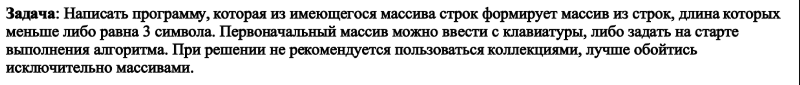

#  Контрольное задание
## Для выполнения  задания необходимо:
* создать репозиторий
* нарисовать блок-схему метода
* создать файл *readme.md*
* написать программу,выпоняющую задачу
* использовать контроль версий

## Задача:

## Алгоритм выполнениия программы:
1. Создание массива;
2. Подсчет количества букв в слове;
3. Вывод.

